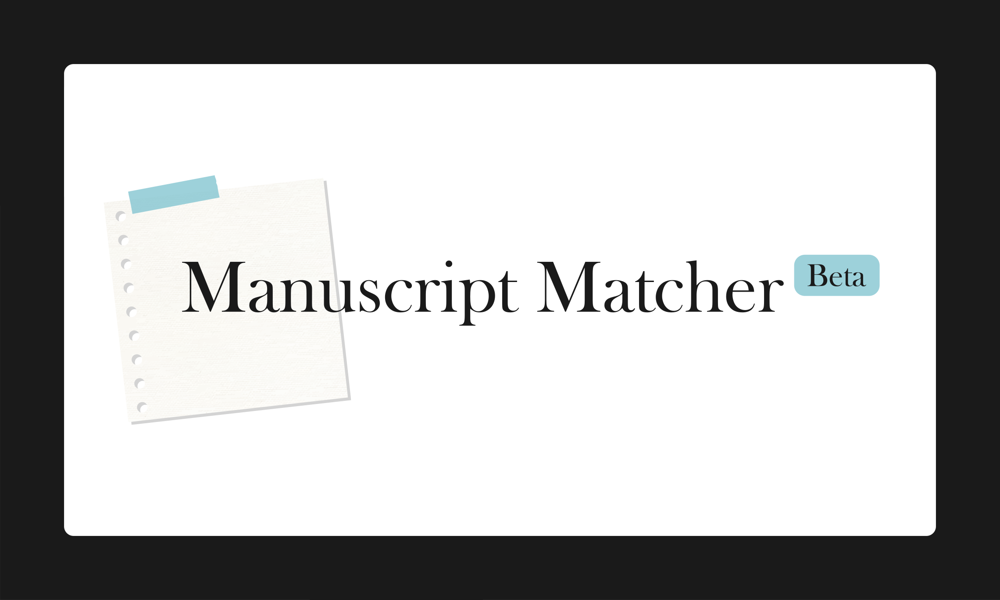
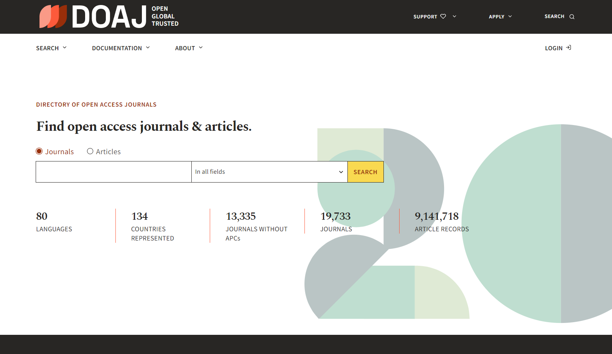
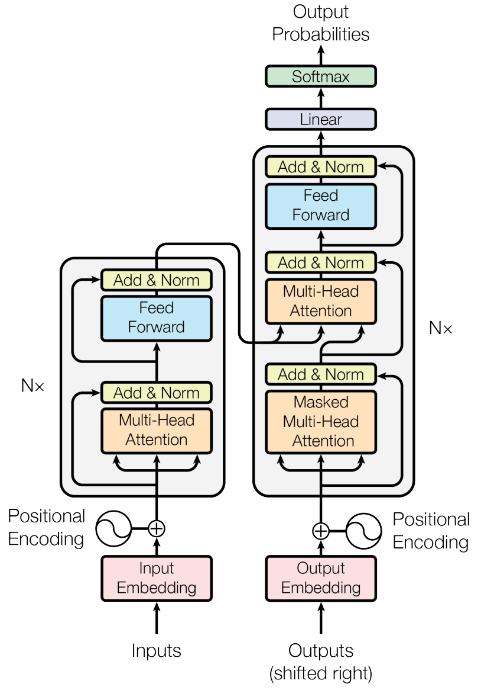
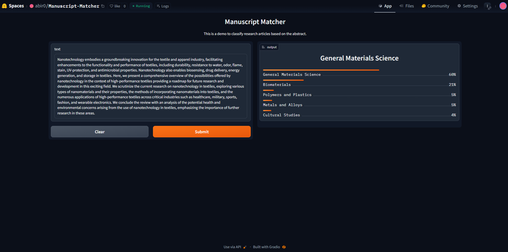
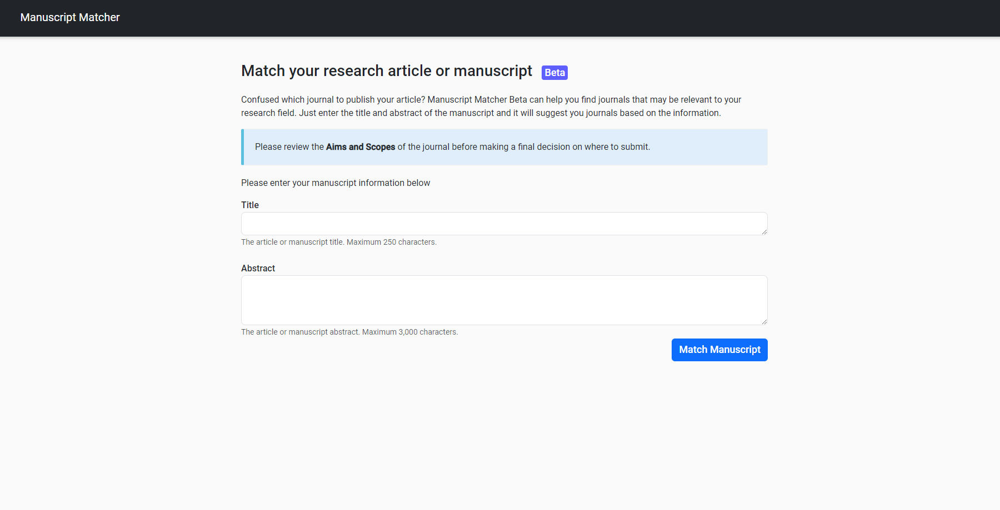

<!-- PROJECT INTRO -->
<h2 align="center">Manuscript Matcher</h2>

<p align="center">
  
</p>
<p align="center">
    A Multi-label Text Classification Project to match manuscripts or research articles with suitable journals based on the title and abstract of the manuscript.
</p>


<!-- TABLE OF CONTENTS -->
<h3> Table of Contents </h3>

- [About The Project](#about-the-project)
  - [Data Collection](#data-collection)
    - [Dataset Description](#dataset-description)
  - [Model Training](#model-training)
    - [Model Description](#model-description)
  - [App Deployment](#app-deployment)
- [Built With](#built-with)
- [Steps to Reproduce](#steps-to-reproduce)
- [Links](#links)
- [License](#license)
- [Contact](#contact)
 

<!-- ABOUT THE PROJECT -->
## About The Project

Match Manuscript is a Multi-label Text Classification project to classify a manuscript or research article based on its subject category and with that it finds the best matching journals for the manuscript. It uses state-of-the-art Language Model DistilRoBERTa, a transformer model from Hugging Face. A large dataset is scraped, collected, and cleaned before the model was trained. The final model is then deployed as a web app on Render. The project can be divided into 3 main parts: Data Collection, Model Training, and Deployment.


### Data Collection

The primary data collection was done by scraping the [Directory of Open Access Journals (DOAJ)](https://doaj.org/). DOAJ is an index or database of journals and articles' metadata. From this website, the `journal name`, article's `title` and `abstract` fields were extracted. The scraping was done using Selenium framework. A secondary dataset was collected from my previous project on [Journal Ranking](https://github.com/abir0/SJR-Journal-Ranking). This dataset had the journal's `subject category` information. The final data for training was obtained after cleaning and processing and merging the datasets. This data pre-processing is performed in the [data processing notebook](notebooks/Manuscript_Matcher_Data_Preprocessing.ipynb) on Google Colab.

#### Dataset Description

The final dataset had the following fields:
 - Journal Name
 - Title
 - Abstract
 - Subject Category

The dataset had a total of 35k+ rows. And there were `61` labels in the `subject category` field, which is the multi-labelled target.

<p align="center">
  <a href="https://doaj.org/"></a><br>
  <i>DOAJ Website</i>
</p>

### Model Training

The model training is done using the [DistilRoBERTa](https://huggingface.co/distilroberta-base) model from Hugging Face Transformers library. This is pre-trained model which is follows the BERT model architecture but it is a distilled version. This model is integrated into the project by transfer learning. After processing and tokenization of the input text data, it is fed into the model. The model training and fine-tuning is performed in the [model training notebook](notebooks/Manuscript_Matcher_Model_Training.ipynb). Then the model is quantized and compressed using ONNX Runtime in the [model inference notebook](notebooks/Manuscript_Matcher_ONNX_Inference.ipynb) and exported as the final model in `.onnx` file, which can be found in the Hugging Face Spaces repo. Hugging Face Transformers, PyTorch, fastai, and finally ONNX Runtime frameworks have been used for model training to exporting.

#### Model Description

The final model had the following architecture:
 - Input Layer (Tokenizer)
 - DistilRoBERTa Model (Similar to Transformer architecture)
 - Linear Layer
 - Sigmoid Activation Layer
 - Output Layer

After training, the model accuracy was ~97% and the train loss was ~0.03 while the validation loss was ~0.06. The model was trained for a total of 10 epochs. The model was trained on the Google Colab GPU.

After ONNX Runtime quantization and compression, the model size was reduced from ~315 MB to ~79 MB. The final F1 scores were: F1 Macro = 0.68 and F1 Micro = 0.58.

<p align="center">
  <br>
  <i>Transformer Model Architecture</i> (arXiv:1706.03762)
</p>

### App Deployment

The final model is hosted on the Hugging Face Spaces. A web app with minimal UI is built around the hosted model using the Flask. The app is deployed on Render web services.

<p align="center">
  <a href="https://abir0-manuscript-matcher.hf.space"></a><br>
  <i>Hugging Face Spaces App</i>
</p>

<p align="center">
  <a href="https://manuscript-matcher-beta.onrender.com"></a><br>
  <i>Deployed Web App </i>
</p>

The deployed app can be accessed HERE: [https://manuscript-matcher-beta.onrender.com](https://manuscript-matcher-beta.onrender.com)

> Note: The app is still in beta version. It does not suggest the best matching journals yet. It only classifies the manuscript into `subject categories`. The best matching journals feature will be added in the future.


<!-- BUILT WITH -->
## Built With

* [Python](https://www.python.org/)
* [Selenium](https://www.selenium.dev/)
* [Pandas](https://pandas.pydata.org/)
* [Hugging Face Transformers](https://huggingface.co/transformers/)
* [Hugging Face Spaces](https://huggingface.co/spaces)
* [PyTorch](https://pytorch.org/)
* [fastai](https://www.fast.ai/)
* [ONNX Runtime](https://onnxruntime.ai/)
* [Flask](https://flask.palletsprojects.com/)
* [Bootstrap](https://getbootstrap.com/)
* [Render](https://render.com/)


## Steps to Reproduce

To reproduce the results, follow the steps below:

1. Clone the GitHub project repo.
```sh
git clone https://github.com/abir0/Manuscript-Matcher.git
```

2. Install the requirements.
```sh
pip install -r requirements.txt
```

3. Run the scraper to collect the data from DOAJ. The scraped data will be saved in the [data](data) folder.
```sh
cd src
python scraper.py
```

4. Download all the data files from the [data](data) folder and place them in the Google Drive folder named `Manuscript-Matcher`.

5. Go to the [data processing notebook](notebooks/Manuscript_Matcher_Data_Preprocessing.ipynb) and run all the cells to clean and preprocess the data.

6. Go to the [model training notebook](notebooks/Manuscript_Matcher_Model_Training.ipynb) and run all the cells to train the model.

7. Go to the [model inference notebook](notebooks/Manuscript_Matcher_ONNX_Inference.ipynb) and run all the cells to evaluate, quantize, and export the final model.

8. Clone the [Hugging Face Spaces](https://huggingface.co/spaces/abir0/Manuscript-Matcher) repository and download the final `.onnx` model into the repo and setup a Hugging Face Space to host the model.
```sh
git clone https://huggingface.co/spaces/abir0/Manuscript-Matcher
```

9. Clone the [Flask web app](https://github.com/abir0/Manuscript-Matcher-Beta) repository and configure the Hugging Face Spaces API.
```sh
git clone https://github.com/abir0/Manuscript-Matcher-Beta.git
```

10.  Setup a Render Web Service and deploy the flask web app on the Render platform.

## Links

- Manuscript Matcher Project: https://github.com/abir0/Manuscript-Matcher
- DOAJ Articles Search Endpoint: https://doaj.org/search/articles
- Journal Ranking Project: https://github.com/abir0/SJR-Journal-Ranking
- Hugging Face Spaces: https://huggingface.co/spaces/abir0/Manuscript-Matcher
- Hugging Face Spaces Direct Link: https://abir0-manuscript-matcher.hf.space
- Flask Web App Repository: https://github.com/abir0/Manuscript-Matcher-Beta
- Deployed Web App on Render: https://manuscript-matcher-beta.onrender.com


<!-- OTHERS -->
## License

Distributed under the MIT License. See `LICENSE` for more information.


## Contact

<h3>Abir Hassan</h3>

[Gmail](mailto:abir.spsc@gmail.com) | [GitHub](https://github.com/abir0) | [LinkedIn](https://www.linkedin.com/in/abir0/)